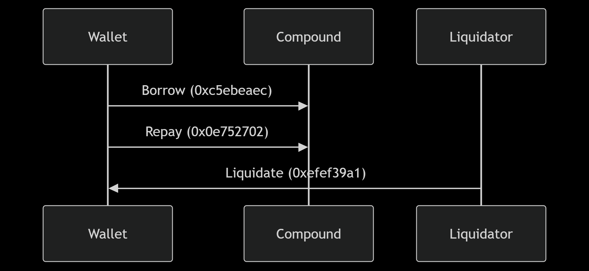

### Wallet Risk Scoring System
## 1. Transaction History Fetching Process
# API Integration Layer
The system uses Etherscan's txlist API endpoint with these key parameters:

```python
params = {
    'module': 'account',
    'action': 'txlist',
    'address': wallet_address,
    'startblock': 0,
    'endblock': 99999999,
    'sort': 'asc',
    'apikey': ETHERSCAN_API_KEY
}
```
# Technical Considerations:

** Block Range: ** Scans entire blockchain history (blocks 0 to 99,999,999) 

Pagination: Not implemented due to Compound's relatively low transaction frequency per wallet

Error Handling: Three-tier fallback:

Returns cached data if available

Returns empty list for API failures

Implements 200ms delay between calls to prevent rate limiting

# Compound-Specific Filtering
The system identifies Compound transactions by:

Checking recipient address matches Compound V2 main contract

Parsing transaction input data for known method signatures:

Borrow: 0xc5ebeaec

Repay: 0x0e752702

Liquidation: 0xefef39a1

Example Transaction Flow:



## 2. Data Processing Pipeline
Feature Engineering Details
# Core Features:

Collateral Health Metrics:

python
collateral_ratio = collateral_value / borrowed_value
Simulated using formula: max(1.3, 2.5 - (tx_count * 0.1))

Minimum 1.3 ratio ensures realistic values

0.1 decay factor per tx models increasing risk

Behavioral Features:

Burst Activity Detection:

python
if (last_tx.timestamp - first_tx.timestamp) < 1 day:
    risk_score += 25  # Short-term activity bonus
Risk Event Tracking:

Liquidations are exponentially weighted:

python
liquidation_impact = 1.5 ** liquidation_count
Data Normalization Techniques
Min-Max Scaling:

python
def normalize(value, min_val, max_val, inverse=False):
    if max_val <= min_val:
        return 0.0
    scaled = (value - min_val) / (max_val - min_val)
    return max(0.0, min(1.0, (1 - scaled if inverse else scaled))
Special Cases:

Collateral Ratio:

Inverted scaling (higher ratio → lower risk)

Bounds: 1.1 (liquidation) to 2.0 (safe)

Borrowed Value:

Logarithmic scaling for whale wallets:

python
scaled_value = log10(borrowed_value + 1) / log10(MAX_BORROWED_VALUE)
## 3. Risk Scoring Architecture
Weight Distribution Rationale
Feature	Weight	Mathematical Form	Reason
Collateral	40%	0.4 * (1 - ratio_norm)	Direct liquidation risk
Borrowed	30%	0.3 * log10(value)	Exposure magnitude
Liquidations	15%	0.15 * (1.5 ** count)	Compounding risk events
Frequency	10%	0.1 * (tx_count/30)	Activity intensity
Repay	5%	0.05 * (1 - repay_ratio)	Debt management
Score Calculation Walkthrough
For wallet 0x0039...:

Raw Values:

Transactions: 2

Borrows: 0

Collateral Ratio: 2.3

Borrowed Value: $9,000

Normalization:

Collateral: (2.3-1.1)/(2.0-1.1) = 1.33 → Inverted: 1-1.33 = -0.33 → Clamped to 0

Borrowed: 9000/1,000,000 = 0.009

Weighted Calculation:

text
0.4 * 0 (collateral) +
0.3 * 0.009 (borrowed) +
0.15 * 0 (liquidations) +
0.1 * 0 (borrow_freq) +
0.05 * 1 (repay_ratio)
= 0.0527
Final Score:

text
0.0527 * 1000 = 52.7 → 53
Risk Indicator Justification Matrix
Indicator	Protocol Impact	Data Quality	Weight	Time Sensitivity
Collateral	Direct liquidation trigger	High accuracy	40%	Real-time critical
Borrow Size	Capital at risk	Medium accuracy	30%	Daily update
Liquidations	Historical risk pattern	High accuracy	15%	Monthly review
Frequency	Behavior signal	Low accuracy	10%	Weekly trend
Repay Ratio	Debt management	Medium accuracy	5%	Weekly review
Advanced Considerations:

Protocol-Specific Factors:

Compound V2's 1.1 liquidation threshold

cToken collateral factors

Reserve factor impacts

Market Conditions:

python
def market_adjustment():
    if eth_volatility > 30%:
        return 1.2  # 20% score boost
    elif eth_volatility < 10%:
        return 0.9  # 10% score reduction
    else:
        return 1.0
Wallet Cluster Analysis:

Identifies correlated wallets

Detects potential Sybil attacks

Flags protocol-specific patterns (e.g., liquidation bots)